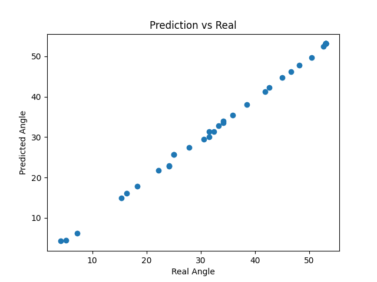
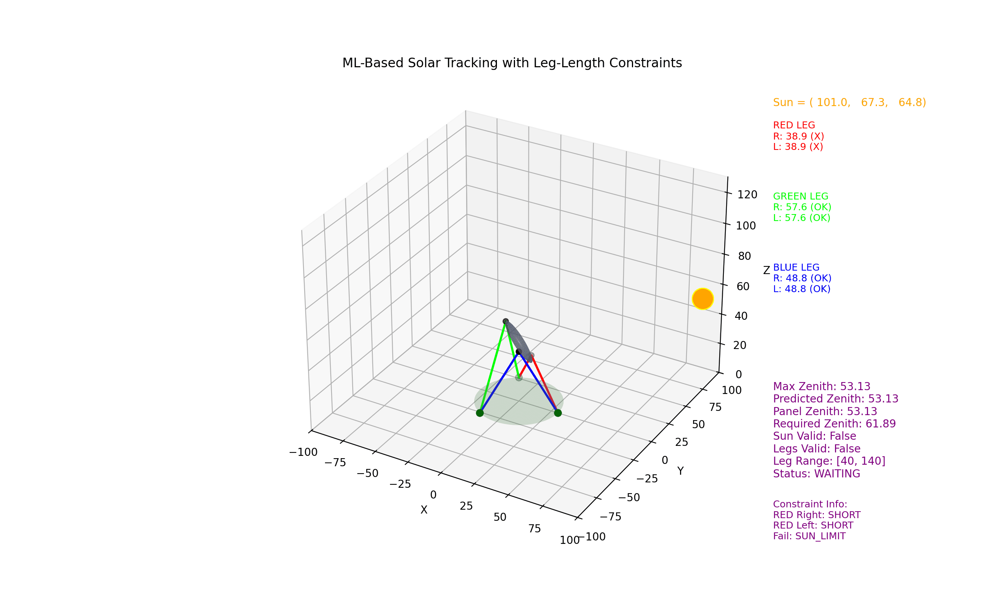

# Sun-Tracking Six-Leg Panel System
## Mathematical Modeling, 3D Simulation and Machine Learning for Solar Tracking

This project presents the **mathematical modeling, kinematic analysis, and real-time 3D simulation** of a sun-tracking solar panel system driven by a **six-leg parallel mechanism inspired by the Stewart platform architecture**.

The system dynamically adjusts the orientation of the solar panel so that its **normal vector aligns with the Sun's direction**, maximizing solar energy exposure.

The project originated as an **academic mathematical modeling study** and is now being extended into a **simulation-driven engineering project with machine learning integration**.

---

# Quick Summary

This project combines **mathematical modeling, simulation engineering, and machine learning** to study optimal solar panel orientation.

**Simulation**

- Six-leg Stewart platform inspired mechanism  
- Real-time 3D visualization  
- Dynamic Sun motion  

**Machine Learning**

- Model: Random Forest Regressor  
- Input: `sun_x`, `sun_y`, `sun_z`  
- Output: `panel_zenith_deg`  

**Current Model Performance**

R² Score ≈ **0.99**

**Control System**

- Constraint-aware state machine (WAITING / TRACKING / LOCKED)  
- Failure classification (SUN_LIMIT vs LEG_LIMIT)  

---

# Project Overview

Solar panels generate maximum energy when their surface is perpendicular to incoming sunlight. Fixed panels or limited-axis tracking systems cannot maintain this optimal orientation throughout the day.

This project develops a **six-degree-of-freedom (6-DOF) parallel mechanism model** capable of continuously adjusting the panel orientation to track the Sun.

The work integrates:

- mathematical modeling  
- kinematic analysis  
- numerical simulation  
- real-time 3D visualization  
- robotics-inspired mechanism design  

The system simulates how a **Stewart platform based structure** could be used to control solar panel orientation in real-time.

---

# Objectives

The main objectives of this project are:

- Develop a **mathematical model for a six-leg solar tracking mechanism**  
- Compute **solar direction vectors over time**  
- Align the **panel normal vector with the Sun**  
- Calculate **required actuator leg lengths**  
- Respect **mechanical tilt constraints**  
- Visualize system behavior through **3D simulation**  

---

# System Description

The simulated system consists of:

- a fixed circular **base platform**  
- a movable circular **solar panel platform**  
- **six adjustable legs** connecting base and panel  
- a dynamic **Sun position vector**

### At each simulation step

1. The Sun position is calculated.  
2. The panel normal vector is aligned with the Sun direction.  
3. Tilt constraints are applied.  
4. Panel attachment points are updated.  
5. Leg vectors and lengths are calculated.  
6. The system state is rendered in a **3D environment**.

---

# Mathematical Modeling

The mathematical model is based on:

- vector geometry  
- coordinate transformations  
- trigonometric relations  
- rotation matrices  
- orientation constraints  
- Euclidean distance calculations  

The panel orientation is determined so that the panel surface remains **orthogonal to the Sun direction**, while respecting mechanical tilt limitations.

---

# Simulation Features

The simulation includes:

- real-time **3D visualization**  
- animated **Sun motion**  
- dynamic **panel orientation**  
- continuous **leg length adjustment**  
- mechanical **tilt constraint handling**  
- **constraint-aware state machine (WAITING / TRACKING / LOCKED)**  
- **failure classification (SUN_LIMIT vs LEG_LIMIT)**  
- **visual feedback through color-coded states**  
- live **system diagnostics panel**
---
# System Behavior

The simulation includes a **state-based control system** that determines how the panel behaves under different physical constraints.

### States

- **WAITING**
  - The system has not yet encountered a valid configuration.
  - The panel remains inactive while waiting for feasible conditions.

- **TRACKING**
  - The panel successfully aligns with the Sun.
  - All actuator (leg) constraints are satisfied.
  - The system actively updates orientation in real-time.

- **LOCKED**
  - The system was previously in a valid configuration but entered an infeasible region.
  - The panel is held at the **last valid configuration**.
  - No further motion is allowed until the simulation resets.

---
# Technologies Used

- **Python**
- **NumPy** — numerical computation
- **Matplotlib** — 3D visualization and animation
- **scikit-learn** — machine learning model training

---

# Project Structure
``` 
Sun-tracking-six-leg-panel-system
│
├── data/
│   └── solar_tracking_dataset.csv
│
├── docs/
│   └── six_leg_panel_system.pdf
│
├── images/
│   ├── simulation.gif
│   └── ml_prediction.png
│
├── src/
│   ├── main.py
│   ├── simulation.py
│   ├── kinematics.py
│   ├── solar_math.py
│   ├── train_model.py
│   └── utils.py
│
├── README.md
├── requirements.txt
└── .gitignore
```
---

# Synthetic Dataset Generation

The simulation can generate a **synthetic dataset** by recording:

- Sun position  
- Panel tilt angle  
- Tracking status  
- Leg lengths  

This dataset can be used for **machine learning based solar tracking optimization**.

---

# Machine Learning Model

A machine learning model has been implemented to predict the **optimal solar panel zenith angle** from the Sun direction vector.

The dataset used for training is generated from the physical simulation.

The trained model is integrated into the simulation and used to predict the required panel orientation in real-time.

## Control System & Constraint Handling

To make the simulation more realistic and closer to a real-world system, additional control logic and physical constraints were implemented.

### State Machine

The system operates using a simple state machine:

- **WAITING** → System is idle or waiting for valid tracking conditions  
- **TRACKING** → Panel actively follows the Sun  
- **LOCKED** → System stops due to physical or geometric limitations  

### Constraint Handling

Two main constraints are considered:

- **Sun Reachability (Tilt Limit)**  
  The system checks whether the required panel orientation is physically achievable.

- **Actuator Limits (Leg Length Constraints)**  
  Each leg has minimum and maximum length limits.  
  If any leg exceeds these limits, the configuration is considered invalid.

### Failure Classification

Failures are classified into two categories:

- **SUN_LIMIT** → Target orientation exceeds tilt capability  
- **LEG_LIMIT** → Required leg lengths are outside actuator limits  

### Visual Feedback

The simulation provides real-time visual feedback:

- 🟢 Tracking → Normal operation  
- 🟡 Waiting → Idle state  
- 🔴 Locked → Constraint violation  

This allows easy monitoring of system behavior during simulation.
### Model Input Features

- `sun_x`
- `sun_y`
- `sun_z`

These represent the **Sun direction vector in 3D space**.

### Target Variable

- `panel_zenith_deg`

This represents the **optimal tilt angle of the solar panel** required to align the panel normal with the Sun direction.

### Model Used

Random Forest Regressor

### Model Performance

**R² Score ≈ 0.99**

This indicates that the model successfully learns the relationship between the Sun vector and the required panel tilt angle.

---

# Prediction Visualization

The following plot shows the relationship between the **real panel angle** and the **model prediction**.

Points close to the diagonal line indicate high model accuracy.



---

# Academic Report

The full academic study describing the mathematical modeling and simulation of the system is available here:

**Download PDF**

[docs/six_leg_panel_system.pdf](docs/six_leg_panel_system.pdf)

---

# Simulation Preview




The following animation demonstrates:

- real-time solar tracking  
- constraint-aware behavior  
- actuator limit enforcement  
- system state transitions  

---


### Constraint Handling

The system evaluates two types of constraints:

- **Solar Constraint**
  - Maximum allowable tilt angle
  - Prevents unrealistic panel orientations

- **Actuator (Leg Length) Constraint**
  - Each leg must remain within:
    ```
    [LEG_MIN, LEG_MAX]
    ```
  - Violations indicate mechanical infeasibility

---

### Failure Classification

The system not only detects constraint violations but also **identifies their cause**:

- `SUN_LIMIT` → required tilt exceeds maximum allowed tilt  
- `LEG_LIMIT` → actuator lengths exceed mechanical limits  

These failure types are **visually distinguished in the simulation**:

- Gray → solar constraint failure  
- Red → actuator constraint failure  

---

### Cycle-Based Reset Logic

The simulation operates in repeating cycles of solar motion.

- When a new cycle begins:
  - The system resets its state
  - Previous lock conditions are cleared
- This allows the system to re-evaluate feasible configurations dynamically

# How to Run

Clone the repository

`git clone https://github.com/aleynaozdogann/sun-tracking-six-leg-panel-system.git`

Navigate into the project folder

`cd sun-tracking-six-leg-panel-system`

Install dependencies

`pip install -r requirements.txt`

Run the simulation

`python src/main.py`

Train the machine learning model

`python src/train_model.py`

---

# Future Development

Planned improvements include:

- constraint-aware machine learning models  
- reinforcement learning for optimal tracking control  
- dynamic modeling (forces, torque, actuator limits)  
- wind and environmental disturbance modeling  
- energy efficiency optimization  
- real-world hardware implementation of the mechanism  
---

# Author

**Aleyna Özdoğan**

Mathematics graduate interested in:

- Artificial Intelligence  
- Simulation Engineering  
- Computational Modeling  
- Data Science