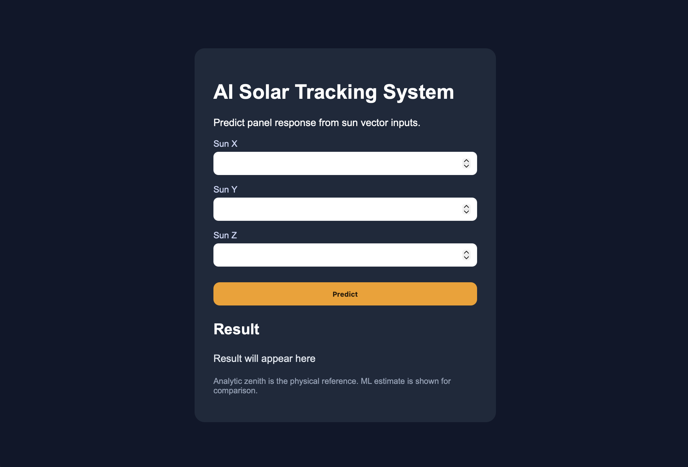

# AI Solar Tracking System

Machine-learning assisted solar tracking platform featuring simulation engineering, FastAPI deployment, and an interactive web dashboard.

This project combines **mathematical modeling**, **simulation engineering**, and **machine learning** to optimize solar panel orientation based on the Sun direction vector.

This project demonstrates how mathematical modeling, machine learning, backend engineering, and simulation systems can be integrated into a single real-time engineering workflow.

---

## Highlights

* Stewart-platform inspired solar tracking simulation
* Six-leg parallel mechanism architecture
* Machine learning angle prediction using Random Forest Regressor
* R² Score > 0.99
* Average prediction error ≈ 0.1°
* FastAPI REST API deployment
* Interactive frontend dashboard
* Constraint-aware tracking logic
* Mechanical tilt and actuator limit validation

---
## Live Demo

Frontend:
https://sun-tracking-six-leg-panel-system.vercel.app

Backend API:
https://sun-tracking-six-leg-panel-system.onrender.com

API Docs:
https://sun-tracking-six-leg-panel-system.onrender.com/docs
## Demo Preview

### Web Interface



### Simulation


### ML Accuracy


---

## Project Architecture

```text
Sun Vector
    ↓
ML Model (Random Forest)
    ↓
Predicted Zenith
    ↓
Constraint Validation
    ↓
3D Simulation Engine
    ↓
Frontend Dashboard
```

---

## Machine Learning Model

### Input Features

* sun_x
* sun_y
* sun_z

### Target

* required_zenith_deg

### Model

* Random Forest Regressor

### Performance

* R² > 0.99
* Average prediction error ≈ 0.1°

### Engineering Improvement

Resolved real-world inference mismatch by aligning training data normalization with production API inputs.

---
## Challenges & Lessons Learned

- Handling physically impossible tracking states caused by actuator constraints
- Preventing unstable panel motion near maximum tilt angles
- Aligning ML training data normalization with production API inputs
- Designing a modular architecture between simulation, ML inference, and backend API
- Improving prediction stability during real-time simulation updates

---
## Simulation Features

* Real-time animated Sun movement
* Dynamic panel orientation tracking
* Six-leg actuator geometry
* Zenith tilt constraints
* Leg length limit detection
* Color-coded system states
* Live diagnostics panel

---

## Tech Stack

### Languages & Libraries

* Python
* NumPy
* Pandas
* Matplotlib
* scikit-learn

### Backend

* FastAPI
* Uvicorn
* SQLite

### Frontend

* HTML
* CSS
* JavaScript

### Tools

* Git
* GitHub
* PyCharm

### Deployment

* Render
* Vercel
---

## API Usage

### Run Locally

```bash
uvicorn src.api:app --reload
```

### Endpoints

POST /predict

Predicts the required panel zenith angle from the given Sun vector.

GET /history

Returns recent prediction history including:
- predicted zenith
- analytic zenith
- prediction error

### Example Request

```json
{
  "sun_x": 35,
  "sun_y": 69,
  "sun_z": 42
}
```

### Example Response
```
{
"predicted_zenith": 61.32,
"analytic_zenith": 61.50
}
```
---

## How to Run

### Clone Repository

git clone https://github.com/aleynaozdogann/sun-tracking-six-leg-panel-system.git
cd sun-tracking-six-leg-panel-system

### Install Dependencies

pip install -r requirements.txt

### Train Model

python src/train_model.py

### Run API

uvicorn src.api:app --reload

### Run Simulation

python src/main.py

---

## Why This Project Matters

This project demonstrates the combination of:

* Machine learning in production
* Real-time simulation systems
* Mathematical modeling
* Backend API engineering
* Frontend integration
* Debugging real-world ML deployment issues

---

## Next Engineering Goals

- Reinforcement learning based adaptive tracking
- Real-time monitoring dashboard
- Hardware actuator integration
- GPU accelerated simulation
- Cloud-native deployment pipeline

---

## Author

**Aleyna Özdoğan**

Mathematics graduate focused on:

* Artificial Intelligence
* Backend Development
* Simulation Engineering
* Computational Modeling
